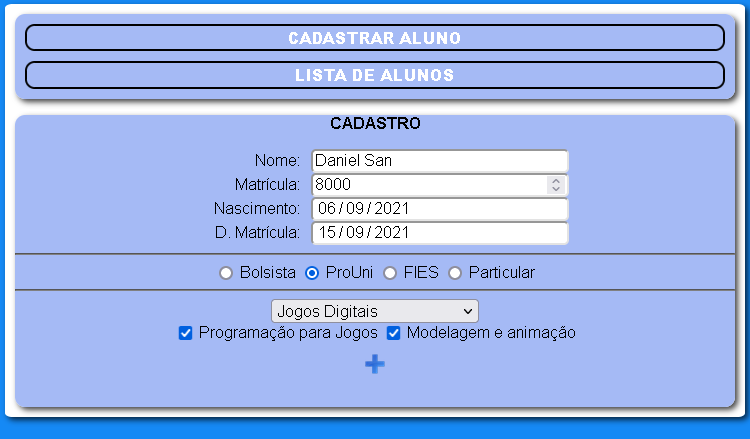
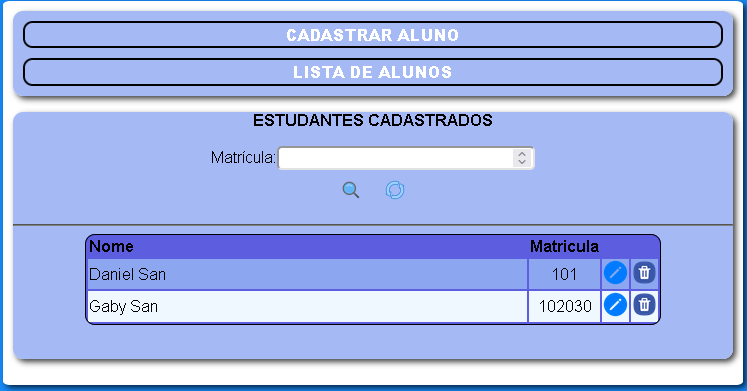

# FBUNI-Tecnologias-da-internet
## ATV1: Para V1
Construir 2 calculadoras, uma simples, soma de 2 valores e outra utilizando layout de teclado numérico.
Atividade foi passada dia *02/09/2021*, a entrega realizada em *05/09/21*.
 

## ATV2: Para V1
### Equipe: 
### Daniel da Costa Vitoriano - 1920124;
### Gabriela Correia Bacellar - 1910745

A atividade consiste em criar um sistema de cadástro de alunos, tendo as funções: adicionar, alterar, excluir e lista de objetos aluno em tabela.
 

